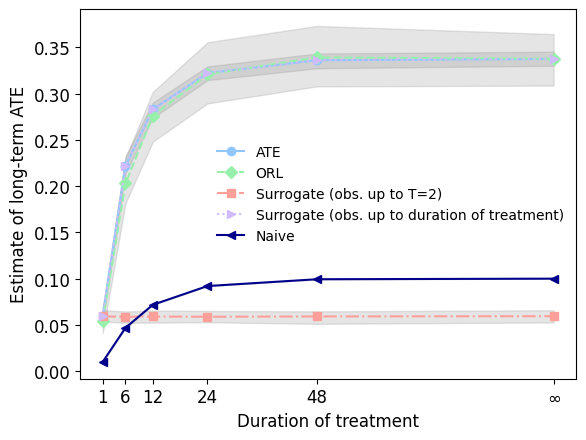

# Code for "Inferring the Long-Term Causal Effects of Long-Term Treatments from Short-Term Experiments"
The following code generates the simulated data and the figure below



Install dependencies
```angular2html
python3.10 -m pip install -r requirements.txt
```

## Simple MDP
Run main script to run the Monte Carlo simulations
```angular2html
python3.10 example.py
```
Run `figures.py` to generate figures (use a notebook or add a line to save the figure)

## Sepsis Simulator
Switch git branch to the `feature/sepsis-sim`
```angular2html
git checkout feature/sepsis-sim
```
Run the [Metaflow](https://metaflow.org/) script `sepsis_flow.py` to generate the data for the results.
```angular2html
python3.10 sepsis_flow.py run
```
